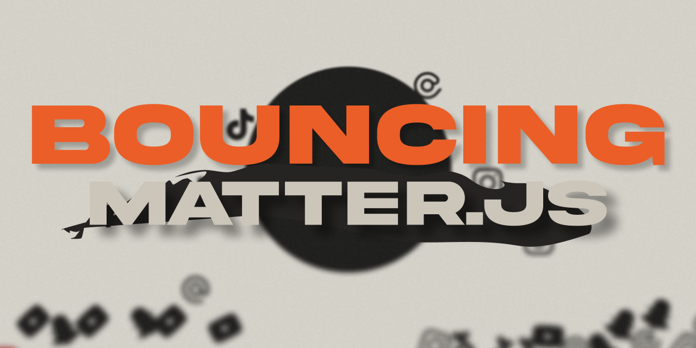

# 💥 BOUNCING — Matter.js avec Next.js

Ce projet est une démonstration simple de l'utilisation de [Matter.js](https://brm.io/matter-js/) (un moteur physique JavaScript 2D) dans une application Next.js.  
Il fait partie des démos créées pour mes vidéos TikTok sur le développement web.



---

## 🚀 Lancer le projet en local

### 1. Cloner le projet

```bash
git clone https://github.com/3mpty-s-playground/bouncing.git
cd bouncing
```

### 2. Installer les dépendances

```bash
npm i
```

### 3. Démarrer le serveur Next.js

```bash
npm run dev
```

Le projet sera accessible à l'adresse : http://localhost:3000

---

## 🛠️ Technos utilisées

- Next.js
  
- Matter.js
  
- Sass
  
- Typescript
  

---

## 📚 Ressources utiles

- [Documentation de Matter.js](https://brm.io/matter-js/)
  
- [Ma vidéo TikTok du projet](https://www.tiktok.com/@3mpty_x/video/7501765190334172438?is_from_webapp=1&sender_device=pc&web_id=7460868888696292887)
